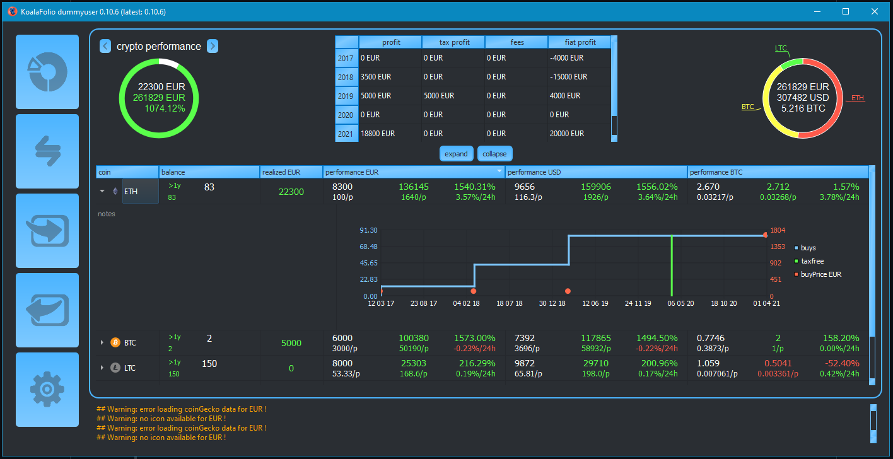

pycryptoportfolio
******************

|Language grade: Python| |Total alerts|

.. |Total alerts| image:: https://img.shields.io/lgtm/alerts/g/2martin2/koalafolio.svg?logo=lgtm&logoWidth=18
   :target: https://lgtm.com/projects/g/2martin2/koalafolio/alerts/
.. |Language grade: Python| image:: https://img.shields.io/lgtm/grade/python/g/2martin2/koalafolio.svg?logo=lgtm&logoWidth=18
   :target: https://lgtm.com/projects/g/2martin2/koalafolio/context:python

|pypi version| |pypi downloads|

.. |pypi version| image:: https://img.shields.io/pypi/v/koalafolio
.. |pypi downloads| image:: https://img.shields.io/pypi/dm/koalafolio

portfolio for cryptocoins with profit export for tax

Installation with PipEnv
-------------------------
   
 - clone repo
 - install python > 3.7
 - install pipenv
 - use pipenv to install dependencies
 - run gui_root.py
 
Installation with Pip
----------------------
   
 - (opt) install python_ > 3.7 (check with python --version or python3 --version or python3.x --version)
 - (opt) install pip (check with pip --version or pip3 --version)
 - install koalafolio for python 3!: (pip install koalafolio or pip3 install koalafolio or python3.x -m pip install koalafolio)
 - run koalafolio from terminal (koalafolio)
 - (opt) update koalafolio (pip install koalafolio --upgrade)
   
.. _python: https://www.python.org/downloads/
   
trade import
-------------
 import trades from exchanges using their export files
  supported exchanges:
   - binance (xls)
   - bitcoinde (csv)
   - bitfinex (csv)
   - bitstamp (csv)
   - bittrex (csv)
   - coinbase (buys, sells and merchant payouts)
   - hitbtc (csv)
   - idex (csv)
   - kraken (csv)
   - kuCoin (csv)
   - okex (csv)
   - poloniex (csv)
   - exodus (v1/txs/.json)
   - others could work as well but not test
   - csv template can be created for manual import
   
 import trades from exchanges using their API:
  supported exchanges:
   - binance
   - bittrex
   - bitmex
   - coinbase
   - coinbasepro
   - gemini
   - poloniex
   - kraken

optional arguments
_____________________
  -h, --help            show this help message and exit
  -v, --version         show version of koalafolio
  -d DATADIR, --datadir DATADIR
                        directory where user data should be stored. make sure
                        it is a valid and writable dir
  -u USERNAME, --username USERNAME
                        username can be used to switch between different
                        portfolios. username will be added to Datafolder
                        (Data_username), so every user has its own settings,
                        trades, styles and so on

portfolio
----------
  load all historical prices from CryptoCompare_ for profit calculation

  display balance, ... of all bought cryptocoins

export
-------
  export profit made in a specific timeframe using FIFO-method (excel)
   - coins can be splitted in wallets to seperate them for tax calculation. (Each Wallet has its own FIFO calculation)
   - language of export english and german (others can be added in translation.txt)

Credits
*********
Thanks to CryptoCompare_

.. _Cryptocompare: https://min-api.cryptocompare.com/

Powered by CoinGecko_ API

.. _CoinGecko: https://www.coingecko.com/en

Gui based on Qt_

.. _Qt: https://www.qt.io/

Thanks to Rotki_

.. _Rotki: https://github.com/rotki
